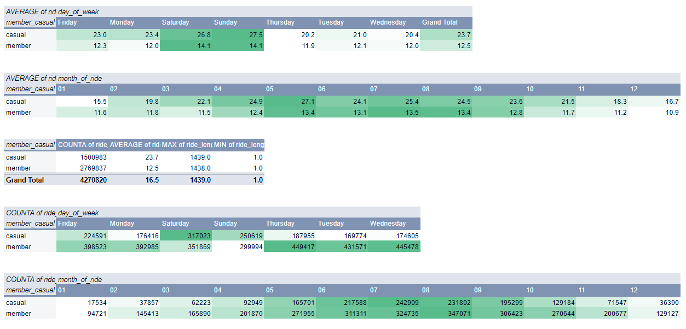
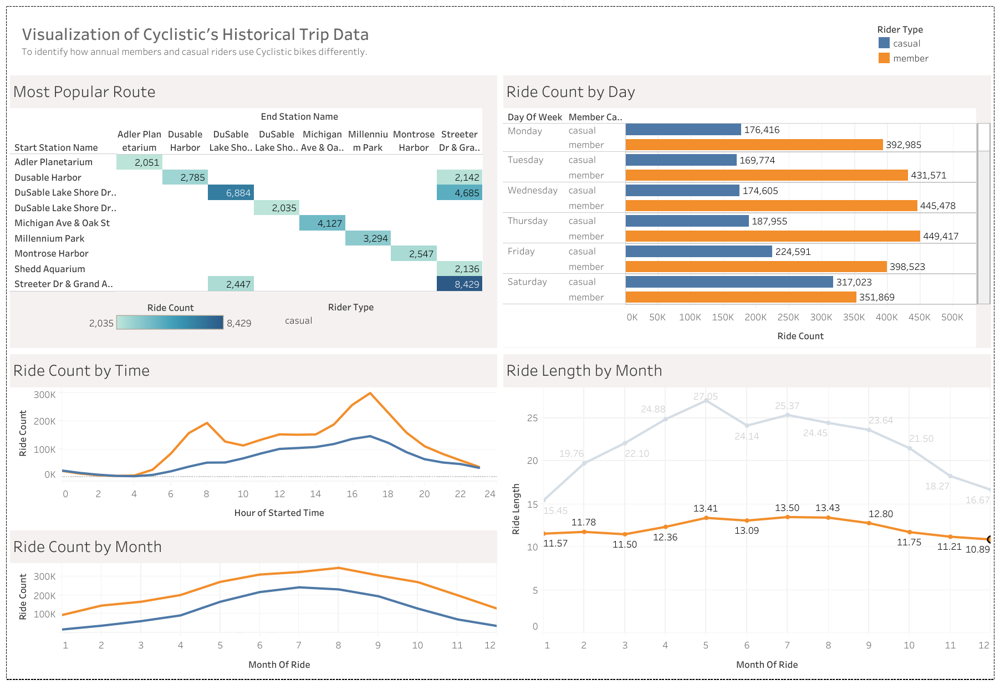

# Cyclistic-Project

## Project 1: Google Data Analytics Capstone Project - Cyclistic

Hello there! Welcome to my first project. In this case study, I assume the role of a data analyst working with the marketing analytics team at Cyclistic, a bike-share company in Chicago. 

### The Context

Until now, Cyclistic’s marketing strategy relied on building general awareness and appealing to broad consumer segments. One approach that helped make these things possible was the
flexibility of its pricing plans: single-ride passes, full-day passes, and annual memberships. Customers who purchase single-ride or full-day passes are referred to as casual riders. Customers who purchase annual memberships are Cyclistic members.

Cyclistic’s finance analysts have concluded that annual members are much more profitable than casual riders. Although the pricing flexibility helps Cyclistic attract more customers, Cyclistic's marketing director believes that maximizing the number of annual members will be key to future growth. Rather than creating a marketing campaign that targets all-new customers, there is a solid opportunity to convert casual riders into members.  

## Step 1: ASK 

### The business task

Identify how annual members and casual members use Cyclistic bikes differently and provide recommendations to convert casual riders to annual members. 

### Stakeholders

* Lily Moreno - Director of Marketing at Cyclistic.
* Cyclistic's marketing analytics team.
* Cyclistic's executive team. 

## Step 2: Prepare

In this analysis, 12 months of historical trip data was analysed. The datasets can be found [here](https://divvy-tripdata.s3.amazonaws.com/index.html).  The data has been made available by Motivate International Inc. under this [license](https://divvybikes.com/data-license-agreement). 

## Step 3: Process 

**Tool(s): SQL BigQuery**

### 1. Combining 12 months of historical trip data into a single table. 

Note: With a total of 5,743,278 rows - SQL was the preferred choice for data cleaning. 

```
CREATE TABLE `capstone-cyclistic-434906.Historical_Data.Combined_Data` AS 
SELECT * 
FROM
  (
  SELECT * FROM `capstone-cyclistic-434906.Historical_Data.2024_05_Part2`
  UNION ALL
  SELECT * FROM `capstone-cyclistic-434906.Historical_Data.2024_05_Part1`
  UNION ALL
  SELECT * FROM `capstone-cyclistic-434906.Historical_Data.2024_04`
  UNION ALL
  SELECT * FROM `capstone-cyclistic-434906.Historical_Data.2024_03`
  UNION ALL
  SELECT * FROM `capstone-cyclistic-434906.Historical_Data.2024_02`
  UNION ALL
  SELECT * FROM `capstone-cyclistic-434906.Historical_Data.2024_01`
  UNION ALL
  SELECT * FROM `capstone-cyclistic-434906.Historical_Data.2023_12`
  UNION ALL
  SELECT * FROM `capstone-cyclistic-434906.Historical_Data.2023_11`
  UNION ALL
  SELECT * FROM `capstone-cyclistic-434906.Historical_Data.2023_10_Part2`
  UNION ALL
  SELECT * FROM `capstone-cyclistic-434906.Historical_Data.2023_10_Part1`
  UNION ALL
  SELECT * FROM `capstone-cyclistic-434906.Historical_Data.2023_09_Part2`
  UNION ALL
  SELECT * FROM `capstone-cyclistic-434906.Historical_Data.2023_09_Part1`
  UNION ALL
  SELECT * FROM `capstone-cyclistic-434906.Historical_Data.2023_08_Part2`
  UNION ALL
  SELECT * FROM `capstone-cyclistic-434906.Historical_Data.2023_08_Part1`
  UNION ALL
  SELECT * FROM `capstone-cyclistic-434906.Historical_Data.2023_07_Part2`
  UNION ALL
  SELECT * FROM `capstone-cyclistic-434906.Historical_Data.2023_07_Part1`
  UNION ALL
  SELECT * FROM `capstone-cyclistic-434906.Historical_Data.2023_06_Part2`
  UNION ALL
  SELECT * FROM `capstone-cyclistic-434906.Historical_Data.2023_06_Part1`
)
```

### 2. Removing NULL values.

```
SELECT
  COUNT(*) - COUNT(ride_id) AS ride_id_null,
  COUNT(*) - COUNT(rideable_type) AS rideable_type_null,
  COUNT(*) - COUNT(started_at) AS started_at_null,
  COUNT(*) - COUNT(ended_at) AS ended_at_null,
  COUNT(*) - COUNT(start_station_name) AS start_station_name_null,
  COUNT(*) - COUNT(start_station_id) AS start_station_id_null,
  COUNT(*) - COUNT(end_station_name) AS end_station_name_null,
  COUNT(*) - COUNT(end_station_id) AS end_station_id_null,
  COUNT(*) - COUNT(start_lat) AS start_lat_null,
  COUNT(*) - COUNT(start_lng) AS start_lng_null,
  COUNT(*) - COUNT(end_lat) AS end_lat_null,
  COUNT(*) - COUNT(end_lng) AS end_lng_null,
  COUNT(*) - COUNT(member_casual) AS member_casual_null
FROM `capstone-cyclistic-434906.Historical_Data.Combined_Data`
```

Columns with NULL values:
* Start_station_name (905,237)
* Start_station_id (905,237)
* End_station_name (956,579)
* End_station_id (956,579)
* End_lat (7,684)
* End_lng (7,684)

```
DELETE FROM `capstone-cyclistic-434906.Historical_Data.Combined_Data`
WHERE 
  start_station_name IS NULL OR
  start_station_id IS NULL OR
  end_station_name IS NULL OR
  end_station_id IS NULL OR
  end_lat IS NULL OR
  end_lng IS NULL;
```

### 3. Check for duplicates of primary key: ride_id 

```
SELECT
  COUNT(ride_id) - COUNT(DISTINCT(ride_id)
FROM `capstone-cyclistic-434906.Historical_Data.Combined_Data` 
```

Output: 0 duplicates.

### 4. Split the started_at & ended_at fields into separate date & time columns for easier analysis.
At the same time, remove unnecessary fields for analysis (start_lat, start_lng, end_lat, end_lng)

```
CREATE TABLE `capstone-cyclistic-434906.Historical_Data.Combined_Data_v2` AS
(
  SELECT
    ride_id,
    rideable_type,
    CAST(started_at AS DATE) AS started_date,
    CAST(started_at AS TIME) AS started_time,
    start_station_name,
    start_station_id,
    CAST(ended_at AS DATE) AS ended_date,
    CAST(ended_at AS TIME) AS ended_time,
    end_station_name,
    end_station_id,
    member_casual
  FROM FROM `capstone-cyclistic-434906.Historical_Data.Combined_Data`
)
```

### 5. Add new columns: ride_length and day_of_week

**Ride Length**
```
CREATE TABLE `capstone-cyclistic-434906.Historical_Data.Combined_Data_v3` AS
(
  SELECT
    *,
    CASE
      WHEN TIME_DIFF(ended_time,started_time, MINUTE) >= 0 THEN TIME_DIFF(ended_time,started_time, MINUTE)
      ELSE TIME_DIFF(ended_time,started_time, MINUTE) + 1440
    END
    AS ride_length
  FROM `capstone-cyclistic-434906.Historical_Data.Combined_Data_v2`
)
```

**Day of Week**

Firstly, modify all dates to the following format: YYYY-MM-DD. 
```
UPDATE `capstone-cyclistic-434906.Historical_Data.Combined_Data_v3`
SET ended_date = CAST(CONCAT("20",RIGHT(CAST(ended_date AS STRING),2),"-",SUBSTR(CAST(ended_date AS STRING),6,2),"-",SUBSTR(CAST(ended_date AS STRING),3,2)) AS DATE)
WHERE ride_id IN
    (
  SELECT
    ride_id
  FROM `capstone-cyclistic-434906.Historical_Data.Combined_Data_v3`
  WHERE
    LEFT(CAST(ended_date AS STRING), 2) = "00"
  )
```
Repeat the above for started_date column. 

Next. add the new columns: year_of_ride, month_of_ride, day_of_week.

```
CREATE TABLE `capstone-cyclistic-434906.Historical_Data.Combined_Data_v4` AS
(
SELECT
  *,
  EXTRACT(YEAR FROM started_date) AS year_of_ride,
  SUBSTR(CAST(started_date AS STRING),6,2) AS month_of_ride,
  FORMAT_DATE('%A', DATE(started_date)) AS day_of_week
FROM `capstone-cyclistic-434906.Historical_Data.Combined_Data_v3`
)
```

### 6. Finally, remove ride_lengths < 1 as these rides are likely to be unintentional, system glitches or that the user changed his/her mind before even riding. 

## Step 4: ANALYZE

**Tool(s): SQL BigQuery + Spreadsheets.**

From SQL BQ, I first explored the cleaned dataset using Google sheets to get a quick summary of my findings. 



* Casual riders have a longer ride_length than annual members.
* Weekends see the longest ride_length for both groups.
* Middle period of the year (May - August) receives a longer ride_length across both groups.
* For casual riders, weekends had more rides than weekedays while for annual riders, weekdays had more rides than weekends.
* Middle period of the year (June - August) receives the most number of rides across both groups.

### Most popular route for both groups

```
SELECT
  start_station_name,
  end_station_name,
  COUNT(ride_id) AS num_of_rides
FROM `capstone-cyclistic-434906.Historical_Data.Combined_Data_v4`
WHERE member_casual = "member"
GROUP BY start_station_name, end_station_name
ORDER BY num_of_rides DESC
LIMIT 10
```
Repeat for casual riders. 

### Most popular ride times for both groups

```
SELECT
  COUNT(*),
  LEFT(CAST(started_time AS STRING),2) AS ride_time
FROM `capstone-cyclistic-434906.Historical_Data.Combined_Data_v4`
WHERE member_casual = "casual"
GROUP BY
  LEFT(CAST(started_time AS STRING),2)
ORDER BY COUNT(*) DESC
LIMIT 10
```
Repeat for annual members.

**Summary of Analysis Findings**

Note: Business task is to identify annual members and casual riders use Cyclistic bikes differently.

* Casual rider trips are significantly longer than that of annual members.
* Casual riders tend to ride more over the weekend while annual members tend to ride more during the weekdays.
* Casual rider trips tend to be two-way - starting and ending at the same station.
Top stations (1) Streeter Dr & Grand Ave and (2) Dusable Lake Shore Dr & Monroe St are both located by large city parks.
* Annual member trips tend to be one way.
Most popular route starting from Calumet Ave & 33rd St (a residential area) to State St & 33rd St (a university campus).
Second most popular route going the other way from State St & 33rd St to Calumet Ave & 33rd St.
* For both groups, late afternoon (1500 - 1900 hrs) represent the top ride times, with 0800-0900 hrs an additional popular timing for annual members. 


**Conclusion**

1. Casual riders tend to use Cyclistic bikes for weekend leisure in the late afternoon, most commonly at the Polk Bros Park and Maggie Daley Park. 

2. Annual members tend to use Cyclistic bikes for commuting during the weekdays, most commonly from the residential area at Calumet Ave & 33rd St to the Illinois Institute of Technology. 

With these findings & insights in mind, the next step focuses on visualizing in a meaningful way for my audience (Lily Moreno and the executive team) to understand.

## Step 5: SHARE 

Tool(s): Tableau Public



You may also explore the entire dashboard [here](https://public.tableau.com/app/profile/daryl.yeo4108/viz/CyclisticAnalysis_17260278009950/Dashboard1).

**Storytelling - Casual riders (Clockwise):**
* Casual riders tend to start and end their journey at the same station, most commonly at Streeter Dr & Grand Ave and Dusable Lake Shore Dr & Monroe St - stations that are beside big city parks.
* Casual riders ride significantly more during the weekends;
* While their ride lengths tend to increase during the summer period when Chicago receives more sunshine.
* Their ride count also reflects this trend, increasing during the summer months.
* Finally, late afternoons are their preferred ride timings. 


## Step 6: ACT

It’s finally time to act on these findings with data-driven recommendations. 
With the objective of converting casual riders to annual members, my recommendations are as follows:

* Cyclistic can organize Out-of-Home (OOH) marketing campaigns at the Polk Bros Park and Maggie Daley Park on Saturdays and Sundays, 3pm to 7pm. This targeted approach ensures that Cyclistic reaches out as many casual riders as possible without wasting additional resources. 

* Marketing budget should be increased during the summer period from May to September as casual riders tend to ride more and are more likely to engage with the campaigns mentioned above. 

* As casual riders tend to ride more during weekends for leisure, weekend memberships could be introduced as a variation of the annual membership. 


*If you've read till here, I thank you for your time. This project has been useful in strengthening my analytical skills with SQL, Spreadsheets and Tableau. If you're interested, I welcome you follow along my data analytics journey by checking out my upcoming projects!* 
