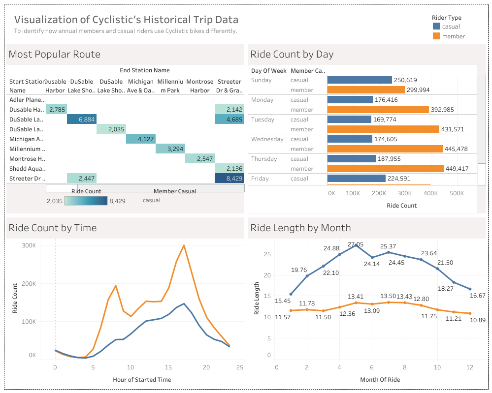

# Cyclistic-Project

## Project 1: Google Data Analytics Capstone Project - Cyclistic


```
{
SELECT
  COUNT(*) - COUNT(ride_id) AS ride_id_null,
  COUNT(*) - COUNT(rideable_type) AS rideable_type_null,
  COUNT(*) - COUNT(started_at) AS started_at_null,
  COUNT(*) - COUNT(ended_at) AS ended_at_null,
  COUNT(*) - COUNT(start_station_name) AS start_station_name_null,
  COUNT(*) - COUNT(start_station_id) AS start_station_id_null,
  COUNT(*) - COUNT(end_station_name) AS end_station_name_null,
  COUNT(*) - COUNT(end_station_id) AS end_station_id_null,
  COUNT(*) - COUNT(start_lat) AS start_lat_null,
  COUNT(*) - COUNT(start_lng) AS start_lng_null,
  COUNT(*) - COUNT(end_lat) AS end_lat_null,
  COUNT(*) - COUNT(end_lng) AS end_lng_null,
  COUNT(*) - COUNT(member_casual) AS member_casual_null
FROM `capstone-cyclistic-434906.Historical_Data.Combined_Data`
}
```


